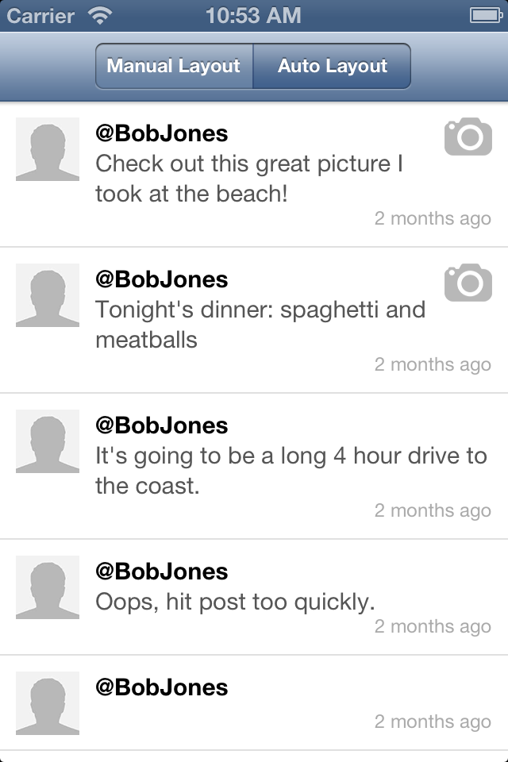

Auto Layout for Table View Cells with Dynamic Heights
=======================

This is the sample application for the blog post [Auto Layout for Table View Cells with Dynamic Heights][1] which implements a Twitter-like table view that can switch between two cell types:

* `JSManualMessageCell` uses manual geometry to position elements in `layoutSubviews`
* `JSAutoMessageCell` uses Auto Layout to position elements with constraints

The table view also implements 3 performance optimizations that can be turned on and off with compile-time feature flags:

1. row height caching (`PERFORMANCE_ENABLE_HEIGHT_CACHE`)
2. separate cell identifier for media cells (`PERFORMANCE_ENABLE_MEDIA_CELL_ID`)
3. iOS 7's `tableView:estimatedHeightForRowAtIndexPath:` (`PERFORMANCE_ENABLE_ESTIMATED_ROW_HEIGHT`)

Screenshot:

[1]: http://johnszumski.com/blog/auto-layout-for-table-view-cells-with-dynamic-heights
